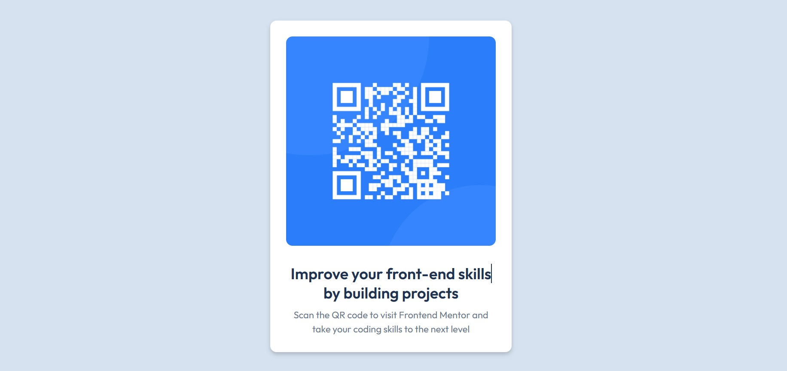

# Frontend Mentor - QR code component solution

- [Overview](#overview)
  - [Screenshot](#screenshot)
  - [Links](#links)
  - [Built with](#built-with)
- [Author](#author)

## Overview

### Screenshot

### Links

- Solution URL: [Add solution URL here](https://your-solution-url.com)
- Live Site URL: [Add live site URL here](https://muhid165.github.io/front-mentor1/)

### Built with

- Semantic HTML5 markup
- CSS custom properties
- Flexbox
- CSS Grid

## Author

- Website - [muhid]
- Frontend Mentor - [@muhiDroid165](https://www.frontendmentor.io/profile/yourusername)

